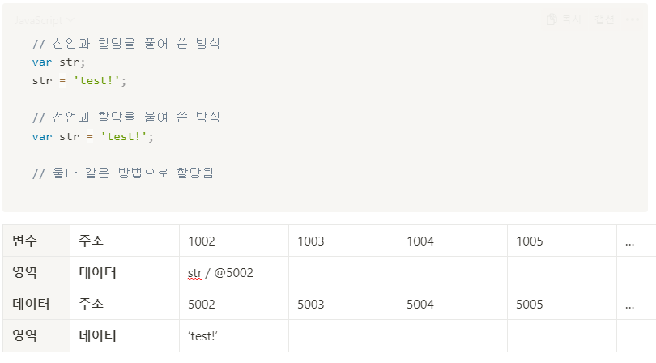
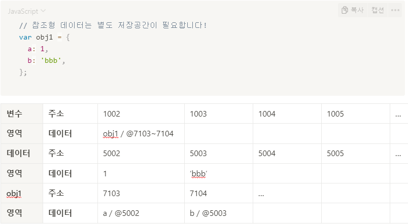
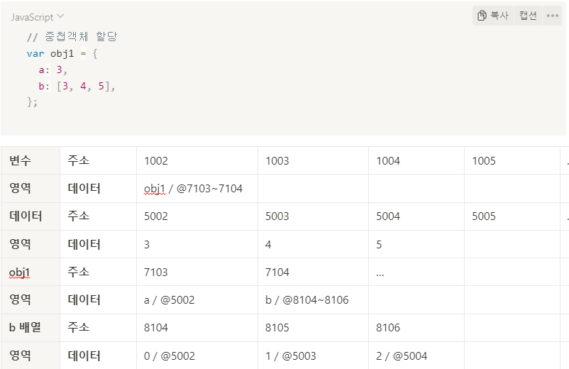
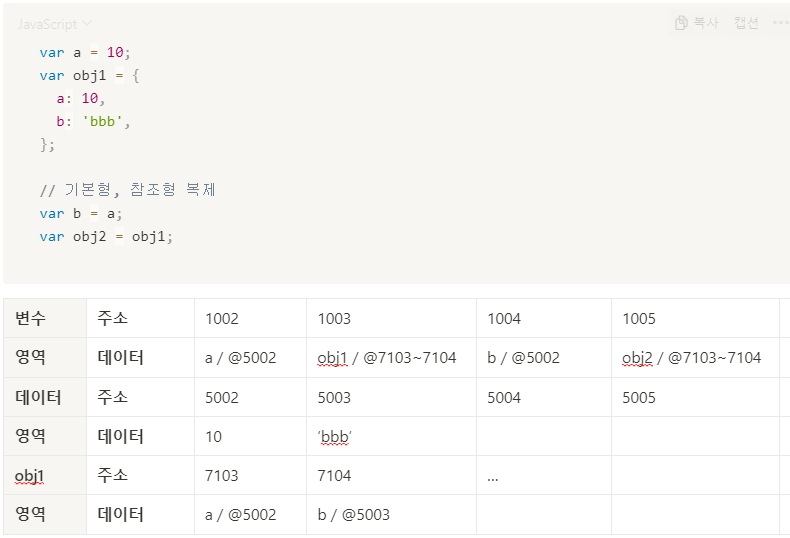
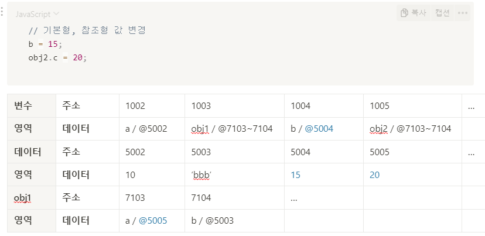

# 데이터 타입의 종류

[ 구분 기준 ]  
1. 값의 복제 방식
   - 기본형 : 값이 담긴 주소값
   - 참조형 : 값이 담긴 주소값으로 이루어진 묶음의 주소값
2. 불변성 여부 (불변성은 메모리를 기준으로 판단)
   - 기본형 : 불변성 O
   - 참조형 : 불변성 X
  
  
# 변수 선언과 메모리 할당
- 메모리 할당할 때, 변수의 위치와 데이터의 위치를 다르게 하여 효율적으로 관리
- 변수와 데이터를 같은 주소에 두지 않는 이유 2가지  
  a. 자유로운 데이터 변환  
  b. 메모리의 효율적인 관리  
- 자세한 방식은 하단에 정리

1. 기본형 변수 할당
   - 데이터를 저장하는 메모리 주소를 변수가 저장되는 메모리 주소에 저장
   - 같은 데이터를 새로 변수로 할당한다면 새로운 변수도 같은 메모리 주소를 갖는다.
   
2. 참조형 변수
   - 객체(객체, 배열 등)을 담는 메모리를 따로 할당
   
3. 중첩 객체 할당
   - 중첩된 객체에 대한 메모리 주소를 또 따로 할당
   
4. 기본형, 참조형 복제
   - 기본형, 참조형 모두 변수의 주소값을 복제
   
5. 기본형, 참조형 값 변경
   - 기본형은 변수 값을 변경하면 새로운 데이터의 주소를 받아옴
   - 참조형은 변수 값을 변경하면 해당 객체의 주소를 받아오기 때문에 변수의 주소는 같음 => 불변성 유지 X
   

# 불변성 유지
- 기본형 데이터는 불변성을 유지하지만 참조형 데이터의 경우 불변성을 유지하지 못함
- 위에서 보여준 복제한 후 참조형 데이터의 값을 변경하는 경우, 기존의 참조형 데이터도 같이 변경되는 문제가 발생하므로 불변성 유지가 중요
- 이런 객체의 특징 때문에 복사하는 방법은 크게 2가지로 나뉘며, 각각의 명칭은 **얕은 복사, 깊은 복사**라고 함.

## 얕은 복사
- 얕은 복사는 객체를 복사할 때 원래값과 복사된 값이 같은 참조를 가리키고 있는 것
- 객체 엔에 객체가 있을 경우 한 개의 객체라도 원본 객체를 참조하고 있다면 얕은 복사
- 예. arr.slice() , object.assign(), spread 연산자

## 깊은 복사
- 깊은 복사는 객체안에 객체가 있을 경우에도 원본과의 참조가 완전히 끊어진 객체
- 복사된 객체가 변경되어도 원본 객체에는 변화가 없음
  1. 재귀 함수 이용
     ```javascript
     var copyObjectDeep = function(target) {
        var result = {};
        if (typeof target === 'object' && target !== null) {
           for (var prop in target) {
              result[prop] = copyObjectDeep(target[prop]);
           }
        } else {
           result = target;
        }
        return result;
     }
     ```
  2. JSON.stringfy()
     - 다른 방식에 비해 비교적 간단하지만, undefinded와 같은 타입은 적용이 안되고 중첩 객체는 적용이 안되는 경우가 많음.
     ```javascript
     const copy = JSON.parse(JSON.stringify(object));
     ```
  4. lodash 라이브러리 사용
     ```javascript
     const copy = _.cloneDeep(obj);
     ```

# undefined vs null
- 둘 다 없음을 의미하지만 undefined는 JS 엔진이 자동으로 반환한다는 점, null은 개발자가 직접 명시한다는 점 이 다름
