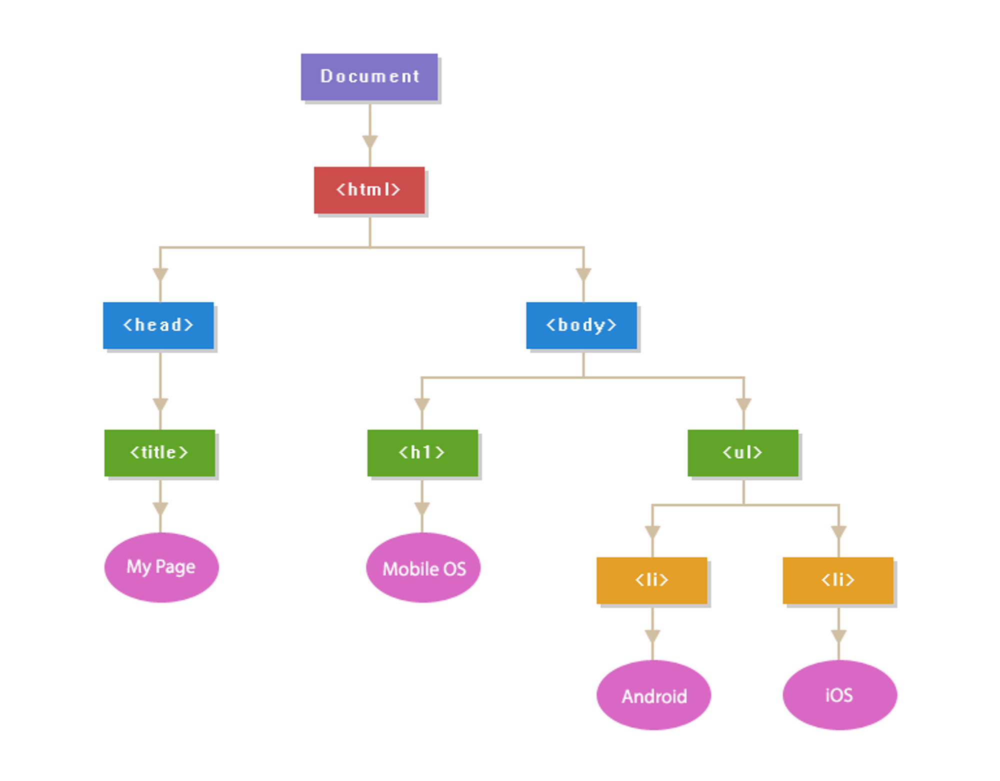

# DOM(Document Object Modeling)
DOM은 JS가 HTML(Domcument)을 이해할 수 있는 형태(Object)로 파싱(Modeling)한 것이다.  
브라우저에 기본적으로 내장되어 있는 API이다(node 환경에서는 없음)  
=> HTML 내용을 JS를 사용하여 **접근&제어** 할 수 있다.  
모든 DOM의 node(모든 DOM의 요소로써, DOM 요소 하나하나가 모두 node)들은 **속성**과 **메서드**를 갖는다.  
아래의 그림이 DOM Tree의 예시. Dom의 가지 하나하나가 모두 node.  


  
# Class
class는 변수, 속성, 메소드를 포함하고 있는 설계도로써, 객체를 생성하기 위한 **하나의 템플릿**이다.  
instance는 class를 사용하여 만들어진 **실제 객체**이다.  
class는 메모리를 할당하지 않고, instance는 실제 메모리를 할당받는다.  
<br>
  
## class 생성하기
class를 생성하기 위해 **class** 키워드를 사용한다.
```javascript
class Animal {
  // constructor -> new 라는 키워드를 이용해서 인스턴스를 만들 때, 기본적으로 넣어야하는 값들
  // constructor는 생성자 함수로, 변수에 할당할 수 없음.
  constructor(name, kind) {
    this.name = name;
    this.kind = kind;
  }

  // class의 메소드 정의
  inform() {
  console.log(`Hello, my name is ${this.name} and I'm a(an) ${this.kind}.`);
  }
}

const animal1 = new Animal("Nabi", "cat");
const animal2 = new Animal("Choco", "dog");

animal1.inform(); // 출력: "Hello, my name is Nabi and I am a(an) cat."
animal2.inform(); // 출력: "Hello, my name is Choco and I am a(an) dog."
```

## getter, setter
Class에서는 getter와 setter를 사용하여 Class의 속성에 접근할 수 있다.  
**getter**는 속성 값을 반환하는 메소드 -> getter를 설정한 변수들만 속성 값을 확인할 수 있음  
**setter**는 속성 값을 설정하는 메소드 -> 인스턴스를 생성할 때 setter를 통해 통과된 객체만 생성을 할 수 있음  
이를 통해 생성한 인스턴스를 정해진 규격 안에서 변경 가능하다.  
this를 통해 접근하는 property는 항상 맨 앞에 언더스코어(_) 사용(private이라는 의미)  
```javascript
class Animal {
  constructor(name, kind) {
    this._name = name;
    this._kind = kind;
  }

  // name을 위한 getter
  get name() {
    return this._name;
  }

  // name을 위한 setter
  set name(value) {
    // 검증 1 : value가 숫자이면 오류!
    if (typeof value !== "string") {
      console.log("[오류] 이름을 문자로 입력해주세요.");
      return;
    // 검증 2 : 길이가 0이면 오류
    } else if (value.length <= 0) {
      console.log("[오류] 이름이 입력되었는지 확인해주세요.");
      return;
    }
    this._name = value;
  }

  inform() {
  console.log(`Hello, my name is ${this._name} and I'm a(an) ${this._kind}.`);
  }
}

const animal1 = new Animal("Nabi", "cat");
const animal2 = new Animal("Choco", "dog");

// getter 예시
console.log(animal1.name); // "Nabi"
// setter 예시
car1.name = 1;             // [오류] 이름을 문자로 입력해주세요.
console.log(animal1.name); // "Nabi"
```

## 상속(Inheritance)
Class는 상속을 통해 다른 Class의 기능을 물려받을 수 있다.  
상속을 받는 Class를 subclass 또는 derived class라고 하고, 상속을 하는 Class를 superclass 또는 base class라고 한다.  
자식 class를 정의할 때, extends 키워드를 사용한다.  
constructor를 그대로 사용할 경우 쓰지 않아도 되지만, 수정할 경우 재정의 해주면 된다. 메소드도 마찬가지. => 오버라이딩  
부모 클래스의 생성자를 수정할 경우 super 키워드를 사용한다.  
```javascript
// 부모 클래스
class Animal {
  constructor(name, kind) {
    this.name = name;
    this.kind = kind;
  }

  inform() {
  console.log(`Hello, my name is ${this.name} and I'm a(an) ${this.kind}.`);
  }
}

// 자식 클래스
class Dog extends Animal {
  // Dog 클래스는 무조건 dog 이므로 kind는 받지 말고, 나이를 받자.
  constructor(name, age) {
    // 부모 클래스에 이름과 종류를 넘겨주자.
    super(name, "dog");
    this.age = age;
  }

  // 부모 클래스의 메소드랑은 다른 내용
  inform() {
  console.log(`Hello, my name is ${this.name} and I'm a(an) ${this.kind}. I'm ${this.age} years old.`);
  }
}

const animal1 = new Animal("Nabi", "cat");
const animal2 = new Dog("Choco", 3);

animal1.inform(); // 출력: "Hello, my name is Nabi and I am a(an) cat."
animal2.inform(); // 출력: "Hello, my name is Choco and I'm a(an) dog. I'm 3 years old."
```

## Static Method
Class에서는 **static** 키워드를 사용하여 Class 레벨의 메소드를 정의  
Class 레벨의 메소드는 인스턴스에서 호출할 수 없으며, Class 이름으로 직접 호출  
인스턴스를 만들지 않고 사용할 수 있기 때문에 **유틸리티 함수, 정적 속성인 경우** 인스턴스 간에 복제할 필요가 없는 데이터(똑같은 것을 공유해서 쓸 때)를 만들 때 사용  
```javascript
class Calculator {
  static add(a, b) {
    return a + b;
  }

  static subtract(a, b) {
    return a - b;
  }
}

console.log(Calculator.add(1, 2)); // 3
console.log(Calculator.subtract(3, 2)); // 1
```
