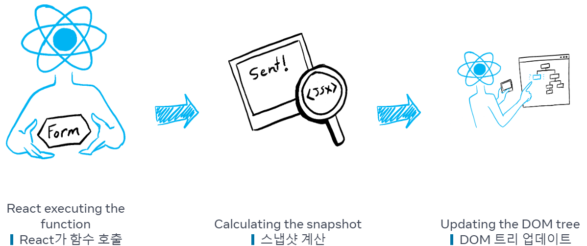
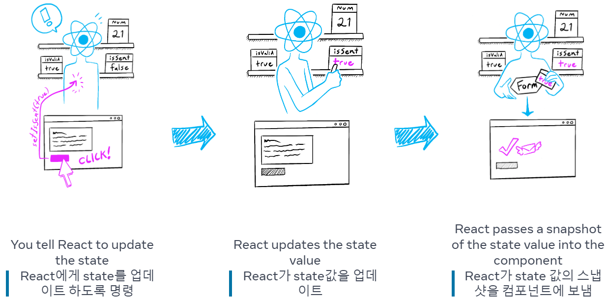

사용자의 입력 혹은 동작에 따라 값이 update될 때가 있다.  
시간이 지남에 따라 변하는 데이터를 **state**라고 한다.  
이번 챕터에서는 상호작용을 처리하고, state를 업데이트하고, 시간에 따라 다른 출력을 표시하는 컴포넌트를 작성하는 방법에 대해 설명한다.  

# 1. Responding to events
```<button>```과 같은 기본 제공 컴포넌트는 ```onClick```과 같은 기본 제공 브라우저 이벤트만 지원한다.  
JSX에서는 이벤트 핸들러 함수를 정의하여 ```onClick```과 같은 이벤트에 적용함으로써 더 다양한 상호작용을 할 수 있다.  

## Event Handler 작성하기
이벤트 핸들러를 함수로 작성하여 적절한 태그에 props로 내려준다.  
button을 클릭하면 alert를 띄워주는 효과를 넣어보자.  
1. Button 컴포넌트 안에 handleClick이라는 함수를 선언  
2. 해당 함수 내부의 로직((alert을 사용하여 메시지 표시))을 구현  
3. JSX의 <button>에 onClick={handleClick}를 추가합니다.  
```javascript
export default function Button() {
  function handleClick() {
    alert('You clicked me!');
  }

  return (
    <button onClick={handleClick}>
      Click me
    </button>
  );
}
```
- 이벤트 핸들러 규칙  
  + 일반적으로 컴포넌트 안에 정의  
  + 이름은 ```handle```로 시작하고 뒤에 이벤트 이름이 오도록 함 ex. handleClick  
  + 인라인으로 작성할 수 있다. (함수가 짧 때) 또한, 인라인으로 작성할 때는 익명 함수로 작성  
  + props로 내려줄 때는 *호출하는 것이 아니라 **전달***  
  + 이벤트 핸들러는 컴포넌트 내부에서 선언되기 때문에 컴포넌트의 props에 접근할 수 있다.  
  + 자식의 이벤트 핸들러를 props로 받을 때 이름을 ```on```으로 시작하고 뒤에 대문자가 오도록 한다.
    ```javascript
    // 이벤트 핸들러를 props로 받을 때 'on'으로 시작
    function Button({ onSmash, children }) {
      return (
        <button onClick={onSmash}>
          {children}
        </button>
      );
    }
    
    export default function App() {
      return (
        <div>
          // 인라인으로 익명함수 작성, 호출이 아닌 전달
          <Button onSmash={() => alert('Playing!')}>
            Play Movie
          </Button>
          <Button onSmash={() => alert('Uploading!')}>
            Upload Image
          </Button>
        </div>
      );
    }
    ```
<br>
  
## Event Propagation
이벤트 핸들러는 자신의 컴포넌트에서만 작동하는 것이 아니라 트리 위로 올라가며 모두 작동한다. => **bubble** 또는 **propagate** 이라고 한다.  
```
<div onClick={() => {
    alert('You clicked on the toolbar!');
  }}>
    <button onClick={() => alert('Playing!')}>
      Play Movie
    </button>
  </div>
);
```
위와 같은 코드에서 Movie 버튼을 누르면 'Playing!' 이라는 알림창이 뜬 후 'You clicked on the toolbar!'라고 뜨면서 2가지 모두 작동한다.  
이는 중지하는 방법이 꼭 필요하다.  

### 전파 중지하기
이벤트 핸들러는 이벤트 객체를 유일한 인수로 받기 때문에 event를 줄여서 "e"로 많이 사용한다.  
이 객체를 사용하여 이벤트에 대한 정보를 읽을 수 있고 전파를 막을 수도 있다. => ```e.stopPropagation()```
```javascript
function Button({ onClick, children }) {
  return (
    <button onClick={e => {
      e.stopPropagation();  // 전파 중지!!!! 
      onClick();
    }}>
      {children}
    </button>
  );
}

export default function Toolbar() {
  return (
    <div onClick={() => {
      alert('You clicked div!');
    }}>
      <Button onClick={() => alert('Playing!')}>
        Play Movie
      </Button>
    </div>
  );
}
```

### default 동작 중지하기
일부 기본 브라우저 이벤트에는 연결된 default 동작들이 있다.  
예. ```<form>```에 onSubmit 이벤트는 버튼을 클릭하면 전체 페이지 로드  
이때, ```e.preventDefault()```를 호출하면 default 동작을 막을 수 있다.  
```javascript
export default function Signup() {
  return (
    <form onSubmit={e => {
      e.preventDefault();
      alert('Submitting!');
    }}>
      <input />
      <button>Send</button>
    </form>
  );
}
```
<br>
  
## Responding to events Recap (이벤트에 응답하기 요약)
- ```<button>```과 같은 태그의 요소에 함수를 prop으로 전달하여 이벤트를 처리할 수 있다.  
- 이벤트 핸들러는 호출이 아니라 전달해야 한다. *onClick={handleClick()} : X,  onClick={handleClick} : O*  
- 이벤트 핸들러 함수를 개별적으로 또는 인라인으로 정의할 수 있다.  
- 이벤트 핸들러는 컴포넌트 내부에 정의되므로 props에 액세스할 수 있다.  
- 부모에서 이벤트 핸들러를 선언하고 이를 자식에게 prop으로 전달할 수 있다.  
- 이름을 지정하여 이벤트 핸들러 prop을 직접 정의할 수 있다.  
- 이벤트는 위쪽으로 전파된다. => 방지하려면 첫 번째 인수에 ```e.stopPropagation()```을 호출하자.
- 이벤트에 원치 않는 기본 브라우저 동작이 있을 수 있다. => 방지하려면 ```e.preventDefault()```를 호출하자.
- 자식 핸들러에서 이벤트 핸들러 prop을 명시적으로 호출하는 것은 전파에 대한 좋은
<br>
  
## Responding to events Try out some challenges (이벤트에 응답하기 도전과제)
### Q1. Fix an event handler
문제 :  
Clicking this button is supposed to switch the page background between white and black.  
However, nothing happens when you click it. Fix the problem.  
(Don’t worry about the logic inside handleClick—that part is fine.)  
  
해결 :  
button의 onClick에 들어가는 이벤트 핸들러 함수인 handleClick이 전달되는 것이 아니라 호출되었기 때문에 작동 X  
```javascript
export default function LightSwitch() {
  function handleClick() {
    let bodyStyle = document.body.style;
    if (bodyStyle.backgroundColor === 'black') {
      bodyStyle.backgroundColor = 'white';
    } else {
      bodyStyle.backgroundColor = 'black';
    }
  }

  return (
    // 호출을 전달로 변경
    <button onClick={handleClick}>
      Toggle the lights
    </button>
  );
}
```

### Q2. Wire up the events
문제 :  
This ColorSwitch component renders a button. It’s supposed to change the page color.  
Wire it up to the onChangeColor event handler prop it receives from the parent so that clicking the button changes the color.  
After you do this, notice that clicking the button also increments the page click counter.  
Your colleague who wrote the parent component insists that onChangeColor does not increment any counters.  
What else might be happening?  
Fix it so that clicking the button only changes the color, and does not increment the counter.  
  
해결  :  
1) 컬러가 바뀌지 않는다 -> onChangeColor를 onClick에 적용  
2) 이벤트가 전파되어 카운트까지 올라간다. -> stopPropation() 적용  
```javascript
export default function ColorSwitch({
  onChangeColor
}) {
  return (
    <button onClick={(e) => {
      e.stopPropagation();
      onChangeColor();
    }}>
      Change color
    </button>
  );
}
```
<br>


# 2. State: A Component's Memory
## state 왜 필요해?
컴포넌트는 상호 작용의 결과로 화면의 내용을 변경해야 하는 경우가 많다.  
form에 입력하면 입력 필드가 업데이트되어야 하고, 구매를 클릭하면 상품이 장바구니에 담겨야 하는 등, 현재의 값을 기억해야 하는데 이때 사용하는 것이 **state**  

'일반 변수로 사용하면 되지 않나?' 생각할 수도 있지만 2가지 이유로 작동이 원활하지 않다.  
1. **Local variables don’t persist between renders.**  
   지역 변수는 렌더링 사이에 유지되지 않는다. 컴포넌트를 재렌더링할 때 처음부터 다시 렌더링 되기 때문에 값이 초기화된다.  
2. **Changes to local variables won’t trigger renders.**  
   지역 변수의 변화는 렌더링을 일으키지 않는다. 지역 변수가 업데이트 되었더라도 렌더링해야 하는 지 react는 알 수 없다.

컴포넌트를 업데이트를 하기 위한 2가지 조건이 모두 충족되지 않기 때문에 이를 유지하기 위한 state가 필요하다.  
```useState``` 훅은 이 모든 것을 제공한다.  
1. 렌더링 사이에 데이터를 유지하기 위한 **state 변수**  
2. 변수를 업데이트하고 렌더링을 일으키는 **state setter 함수**
<br>
  
> ### Hook 이란?
> React에서 "use"라는 단어로 시작하는 함수들은 Hook이라고 한다.
> 렌더링 중일 때만 사용할 수 있는 함수로 컴포넌트가 React 기능을 사용할 수 있게 해주는 특수한 함수이다.
> “컴포넌트의 최상위 레벨” (최상위 컴포넌트 아님) 또는 커스텀 훅(커스텀 훅도 "use"로 시작할 것)에서만 호출할 수 있다.
> 조건문, 반복문 또는 기타 중첩된 함수 내부에서는 훅을 호출할 수 없다.  
> 자세한 내용은 다음 챕터에서 확인
<br>

## useState 사용법
```javascript
import { useState } from 'react';

const [index, setIndex] = useState(0);
const [showMore, setShowMore] = useState(false);
```
```useState```의 사용법은 간단하다.  
state변수에 넣어줄 초기값을 넣어주고 ```[state 변수, setter 함수]``` 로 받아주면 끝!  
useState는 변수와 setter함수를 한 쌍으로 반환하기 때문에 구조분해할당을 통해서 받는다.  
이 쌍의 이름의 ```const [something, setSomething]```으로 짓는 것이 일반적이다.  
state는 서로 연관이 없는 경우 여러 개의 state 변수를 갖는 것이 좋지만, 두 개 이상의 state가 연관이 있다면 *객체를 사용*하여 하나의 state로 만들어 주는 것이 좋다.  
<br>
  
## useState 구동 원리
```javascript
let componentHooks = [];
let currentHookIndex = 0;

// How useState works inside React (simplified).
function useState(initialState) {
  let pair = componentHooks[currentHookIndex];
  if (pair) {
    // This is not the first render,
    // so the state pair already exists.
    // Return it and prepare for next Hook call.
    currentHookIndex++;
    return pair;
  }

  // This is the first time we're rendering,
  // so create a state pair and store it.
  pair = [initialState, setState];

  function setState(nextState) {
    // When the user requests a state change,
    // put the new value into the pair.
    pair[0] = nextState;
    updateDOM();
  }

  // Store the pair for future renders
  // and prepare for the next Hook call.
  componentHooks[currentHookIndex] = pair;
  currentHookIndex++;
  return pair;
}
```
위의 코드가 공식문서에서 내부적으로 useState가 어떻게 구동되는지에 대한 아이디어로 공개한 코드이다.  
useState를 선언할 때마다 ```componentHooks``` 배열에 추가가 되고 setter 함수를 사용하면 DOM을 업데이트 시킴으로써 재렌더링을 시킨다.  
<br>

## state가 Local 하다고?
state는 화면상의 특정 컴포넌트 Instance에 지역적(Local)하다.  
즉, **동일한 컴포넌트를 두 군데에서 렌더링하면 각각은 완전히 격리된 state를 갖게 된다!**  
둘 중 하나의 state를 변경해도 다른 state는 변경되지 않는다. 이것이 일반 변수와 state의 차이점  => **Isolated**  
  
state가 있는 자식 컴포넌트를 사용하는 부모 컴포넌트는 state의 여부조차 알 수 없다.  
props와 달리 **state는 이를 선언하는 컴포넌트 외에는 완전히 비공개**이며, 부모 컴포넌트는 이를 변경할 수 없다. => **Private**  
이러한 이유로 다른 컴포넌트에 영향을 주지 않고 state를 추가하거나 제거할 수 있다.  
<br>
  
## State: A Component's Memory Recap(State : 컴포넌트의 메모리 요약)
- 컴포넌트가 렌더링 사이에 일부 정보를 “기억”해야 할 때 state 변수를 사용한다.  
- state 변수는 useState 훅을 호출하여 선언  
- 훅은 use로 시작하는 특수 함수이다. state와 같은 React 기능을 “연결”할 수 있게 해줍니다.  
- 훅은 모듈에서 import할 때와 마찬가지로, 컴포넌트 안에서 조건과 무관하게 항상 호출해야 한다.  
  useState를 포함한 훅을 호출하는 것은 컴포넌트나 다른 훅의 최상위 레벨에서만 유효하다.  
- useState 훅은 현재 state와 이를 업데이트할 함수로 이루어진 한 쌍을 반환한다.  
- state 변수는 둘 이상 가질 수 있고, 내부적으로 React는 이를 순서대로 일치시킵니다.  
- state는 컴포넌트 외부에 비공개된다. 두 곳에서 렌더링하면 각 복사본은 고유한 state를 갖는다.  
<br>
  
## State: A Component's Memory Try out some challenges (State : 컴포넌트의 메모리 도전 과제)
### Q1. Complete the gallery
문제 :  
When you press “Next” on the last sculpture, the code crashes. Fix the logic to prevent the crash.  
You may do this by adding extra logic to event handler or by disabling the button when the action is not possible.  
After fixing the crash, add a “Previous” button that shows the previous sculpture. It shouldn’t crash on the first sculpture.  
  
해결 :  
1. Next 버튼은 alert를 띄우고 setIndex를 하지 않았다.  
2. Prev 버튼은 활성화/비활성화 기능을 적용했다.  
```javascript
import { useState } from "react";
import { sculptureList } from "./data.js";

export default function Gallery() {
  const [index, setIndex] = useState(0);
  const [showMore, setShowMore] = useState(false);

  function handlePrevClick() {
      setIndex(index - 1);
  }
  function handleNextClick() {
    if (index === sculptureList.length - 1) {
      alert("추후 업데이트 예정");
    } else {
      setIndex(index + 1);
    }
  }

  function handleMoreClick() {
    setShowMore(!showMore);
  }

  let sculpture = sculptureList[index];
  return (
    <>
      <div style={{display: "flex"}}>
        <button disabled={index===0?true:false} onClick={handlePrevClick}>Prev</button>
        <button onClick={handleNextClick}>Next</button>
      </div>
      <h2>
        <i>{sculpture.name} </i>
        by {sculpture.artist}
      </h2>
      <h3>
        ({index + 1} of {sculptureList.length})
      </h3>
      <button onClick={handleMoreClick}>
        {showMore ? "Hide" : "Show"} details
      </button>
      {showMore && <p>{sculpture.description}</p>}
      
    </>
  );
}
```
  
### Q2. Fix stuck form inputs
문제 :  
When you type into the input fields, nothing appears. It’s like the input values are “stuck” with empty strings.  
The value of the first ```<input>``` is set to always match the firstName variable,  
and the value for the second ```<input>``` is set to always match the lastName variable. This is correct. `
Both inputs have onChange event handlers, which try to update the variables based on the latest user input (e.target.value).` 
However, the variables don’t seem to “remember” their values between re-renders.  
Fix this by using state variables instead.  
  
해결 :   
firstName과 lastName을 하나로 묶은 객체를 state로 만들었다.  
change 함수를 하나로 만드려고 했으나 귀찮아서...ㅎ..ㅎㅎ  
```javascript
import { useState } from "react";

export default function Form() {
  const [name, setName] = useState({
    firstName : '',
    lastName : ''
  })
  const {firstName, lastName} = name;

  function handleFirstNameChange(e) {
    const firstName = e.target.value;
    setName({
      ...name,
      firstName : firstName
    })
  }

  function handleLastNameChange(e) {
    const lastName = e.target.value;
    setName({
      ...name,
      lastName : lastName
    })
  }

  function handleReset() {
    setName({
      firstName : '',
      lastName : ''
    })
  }

  return (
    <form onSubmit={e => e.preventDefault()}>
      <input
        placeholder="First name"
        value={firstName}
        onChange={handleFirstNameChange}
      />
      <input
        placeholder="Last name"
        value={lastName}
        onChange={handleLastNameChange}
      />
      <h1>Hi, {firstName} {lastName}</h1>
      <button onClick={handleReset}>Reset</button>
    </form>
  );
}
```

### Q3. Fix a crash
문제 :  
Here is a small form that is supposed to let the user leave some feedback.  
When the feedback is submitted, it’s supposed to display a thank-you message.  
However, it crashes with an error message saying “Rendered fewer hooks than expected”.  
Can you spot the mistake and fix it?  
  
해결 :  
message state가 컴포넌트의 최상위 레벨에서 정의되지 않았기 때문에 에러가 난 것!  
위치를 위로 올려준다.  
```javascript
import { useState } from 'react';

export default function FeedbackForm() {
  const [isSent, setIsSent] = useState(false);
  const [message, setMessage] = useState('');

  if (isSent) {
    return <h1>Thank you!</h1>;
  } 
  
  return (
    <form onSubmit={e => {
      e.preventDefault();
      alert(`Sending: "${message}"`);
      setIsSent(true);
    }}>
      <textarea
        placeholder="Message"
        value={message}
        onChange={e => setMessage(e.target.value)}
      />
      <br />
      <button type="submit">Send</button>
    </form>
  );
}

```

### Q4. Remove unnecessary state
문제 :  
When the button is clicked, this example should ask for the user’s name and then display an alert greeting them.  
You tried to use state to keep the name, but for some reason it always shows “Hello, !“.  
To fix this code, remove the unnecessary state variable. (We will discuss about why this didn’t work later.)  
Can you explain why this state variable was unnecessary?  
  
해결 :  
state는 컴포넌트의 리렌더링 정보에만 사용하는 것이다.  
prompt에서 alert로 넘어가는 로직은 DOM 업데이트가 적용되지 않기 때문에 state를 제거하고 일반 변수를 사용한다.  
```javascript
export default function FeedbackForm() {
  function handleClick() {
    const name = prompt('What is your name?');
    alert(`Hello, ${name}!`);
  }

  return (
    <button onClick={handleClick}>
      Greet
    </button>
  );
}
```
<br>


# 3. Render and Commit
React에서 Rendering 과정에 대해 알아보자.  
> 렌더링의 의미가 뭘까요?? ㅇㅁㅇ????
  
## Redering의 과정

  
컴포넌트가 렌더링되는 과정을 항상 요리사와 웨이터로 비유되곤 한다.  
주방에서 요리사가 컴포넌트를 요리하면 사용자에게 주문을 받고 서빙을 하는 과정을 웨이터 역할을 React가 담당하고 있다.  
위의 그림을 설명하자면, 
1. 손님의 주문을 주방으로 전달 => 렌더링 활성화  
2. 주방에서 주문 받기 => 컴포넌트 렌더링  
3. 테이블에 주문한 요리 내놓기 => DOM에 커밋
<br>

### STEP 1. Trigger a render
렌더링이 일어나는 상황 2가지
1. 컴포넌트의 **첫 렌더링**일 때
2. 컴포넌트의 **state가 업데이트** 된 경우 (혹은 상위 요소 중 하나)
   컴포넌트의 state를 업데이트하면 자동으로 렌더링이 대기열에 추가

### STEP 2. React renders your components
**"Redering”은 React에서 컴포넌트를 호출하는 것**  
첫 렌더링에서 React는 루트 컴포넌트를 호출한다. 이후 렌더링에서 React는 state 업데이트에 의해 렌더링이 발동된 함수 컴포넌트만을 호출한다.  
이 과정은 재귀적이기 때문에 중첩된 컴포넌트가 더 이상 없고 React가 화면에 표시되어야 하는 내용을 정확히 알 때까지 이 단계는 계속된다.  

> ### Redering은 항상 Pure Caculation이어야 한다.
> - 동일한 입력에는 동일한 출력
> - 이전의 state를 변경 X
>   렌더링 전에 존재했던 객체나 변수를 변경해서는 안 된다.

### STEP 3. React commits changes to the DOM
렌더링 간에 차이가 있는 경우에만 DOM 노드를 변경 

## Render and Commit Reacap (렌더링하고 커밋하기 요약)
- React 앱의 모든 화면 업데이트 세 단계
  1. 트리거
  2. 렌더링
  3. 커밋
- Strict Mode를 사용하여 컴포넌트에서 실수를 찾을 수 있다.
- 렌더링 결과가 이전과 같으면 React는 DOM을 건드리지 않는다.
<br>
  
  
# 4. State as a Snapshot
state는 읽고 쓸 수 있는 일반 JS 변수처럼 보이지만, snapshot 처럼 작동한다.  

## state setting 과 re-render trigger
클릭과 같은 사용자 이벤트에 대해서 UI가 직접 변경되는 것 처럼 보이지만 사실이 아니다.  
React에서는 UI에 반응하여 적용하기 위해서는 state을 업데이트하여 re-rendering을 일으켜야 한다.  
  
UI에 반응하는 과정 :  
1. 이벤트 핸들러가 실행  
2. 핸들러 안에 있는 함수를 실행시키는 렌더링이 Queue에 대기  
3. 새로운 state에 따라서 컴포넌트를 재렌더링
  
렌더링이란 컴포넌트 즉, 함수를 호출한다는 뜻이다. 이때 반환된 JSX는 호출된 시점의 스냅샷과 같다.  
props, 이벤트 핸들러, 지역 변수 모두 그 시점의 state를 사용하여 계산하고 react는 그 당시의 snapshot과 일치하도록 화면을 업데이트 한다.  
  
컴포넌트를 다시 렌더링할 때 :  

  
state는 실제로 함수 외부에 마치 선반에 있는 것처럼 **React 자체에 존재**한다.  
컴포넌트는 호출된 렌더링의 state 값을 사용해 계산된 새로운 props 세트와 이벤트 핸들러가 포함된 UI의 스냅샷을 JSX에 반환한다.  

<br>
  
> Setting state only changes it for the next render. 이 문구가 이해되지 않음
<br>
  
```javascript
<button onClick={() => {
  setNumber(number + 1);
  setNumber(number + 1);
  setNumber(number + 1);
}}>+3</button>
```
<br>
  
위와 같은 이벤트 핸들러가 있다면, 해당 세팅 함수들은 queue의 대기열에서 모두 같은 ```number```의 상태값을 가지고 있기 때문에, 모두 같은 숫자로 업데이트 된다.  
기존의 number가 0이었다면 세 개의 세팅함수 모두 ```0 + 1```을 수행하는 것이다.  
  
**React는 하나의 렌더링 이벤트 핸들러 내에서 state 값을 고정한다.**  
state를 세팅할 때 새로운 렌더링을 요청하지만 이미 실행 중인 코드에서는 비동기적이더라도 렌더링을 하는 도중에 state 변수값은 변경하지 않는다.  
<br>
  
## State as a Snapshot Recap (스냅샷으로써 state 요약)
- state를 설정하면 새 렌더링을 요청  
- React는 컴포넌트 외부에 마치 선반에 보관하듯 state를 저장  
- ```useState```를 호출하면 React는 해당 렌더링에 대한 state의 스냅샷을 제공  
- 변수와 이벤트 핸들러는 다시 렌더링해도 *살아남지* 않는다. 모든 렌더링에는 자체 이벤트 핸들러가 있다.  
- 모든 렌더링(과 그 안에 있는 함수)은 항상 React가 그 렌더링에 제공한 state의 스냅샷을 *바라본다.*   
- 렌더링된 JSX에 대해 생각하는 것처럼 이벤트 핸들러에서 state를 정신적으로(?) 대체 가능  
- **과거에 생성된 이벤트 핸들러는 그것이 생성된 렌더링 시점의 state 값을 갖는다.**  
<br>
  
## State as a Snapshot Try out some challenges (스냅샷으로써 state 도전과제)
### Q1. Implement a traffic light
문제 :  
Here is a crosswalk light component that toggles when the button is pressed:  
Add an alert to the click handler.   
When the light is green and says “Walk”, clicking the button should say “Stop is next”.  
When the light is red and says “Stop”, clicking the button should say “Walk is next”.  
Does it make a difference whether you put the alert before or after the setWalk call?  

해결 :  
walk가 true이면 “Stop is next”, false이면 “Walk is next”를 보여주는 alert를 넣었다.  
setWalk 전후에 넣는 것은 상관없다. 렌더링이 일어나는 도중에 walk는 이전의 값으로 계산하기 때문이다.  
```javascript
import { useState } from 'react';

export default function TrafficLight() {
  const [walk, setWalk] = useState(true);

  function handleClick() {
    alert(walk ? 'Stop is Next' : 'Walk is Next');
    setWalk(!walk);
  }

  return (
    <>
      <button onClick={handleClick}>
        Change to {walk ? 'Stop' : 'Walk'}
      </button>
      <h1 style={{
        color: walk ? 'darkgreen' : 'darkred'
      }}>
        {walk ? 'Walk' : 'Stop'}
      </h1>
    </>
  );
}
```
<br>
  
  
# 5. Queueing a Series of State Updates
state 변수를 setting하면 대기열(Queue)에 들어간다. 이 때 앞서 얘기한 규칙대로 같은 state을 여러번 불러도 여러번 업데이트 되지 않는다.  
하지만 렌더링을 하는 도중에도 여러번 변경하고 싶다고 한다면 어떻게 해야할까?  

> ### Queue가 뭐지?
> 큐(Queue)는 한쪽 끝에서만 삽입이 이루어지고, 다른 한쪽 끝에서는 삭제 연산만 이루어지는 유한 순서 리스트 형태의 자료구조를 말한다.  
> 큐는 **First in First Out** (FIFO) 선입선출이라고 생각하자. 제일 먼저 들어온 데이터 혹은 함수가 가장 먼저 처리된다.
> 


## state 업데이트를 batch로 처리한다고?
각 렌더링의 state 값은 고정되어 있기 때문에 setting ft.을 여러번 불러도 항상 같은 값을 바라본다.  
이 때 React는 state 업데이트를 하기 전에 이벤트 핸들러의 모든 코드가 실행될 때까지 기다린다. 그렇기 때문에 재렌더링은 이벤트 핸들러안에 있는 모든 코드의 호출이 완료된 후에 일어난다.  
이렇게 하면 너무 많은 렌더링을 유발하지 않고, 다수의 state 변수를 처리할 수 있고, 일부 변수만 업데이트된 *반쯤 완성된* 혼란스러운 렌더링을 처리하지 않아도 된다.   
이런 방식을 **일괄 처리(Batching)**이라고 한다.  
다만, 클릭과 같은 의도적인 이벤트에 대해서는 일괄 처리를 하지 않는다.  
<br>
  
## 동일 state 동일 렌더링에서 여러번 업데이트 하기
흔하지도 않고, 권고하지도 않지만 만약에 동일한 state를 여러번 업데이트 하고 싶다면 지금까지 처럼 값으로 대체하지 말고 계산하는 함수를 전달하자.  
```javascript
<button onClick={() => {
  setNumber(n => n + 1);
  setNumber(n => n + 1);
  setNumber(n => n + 1);
}}>+3</button>
```
위의 코드처럼 기존의 값을 인수로 받아 더해주는 함수를 전달한다면, 큐에 차례대로 들어가있던 setNumber가 차례대로 state의 변경을 업데이트할 것이다.  
|queued update|n|returns|
|---|---|---|
|n => n + 1|0|0+1 => 1|
|n => n + 1|1|1+1 => 2|
|n => n + 1|2|2+1 => 3|
  
이렇게 세팅함수에 들어가는 함수를 **updater fuction**이라고 부른다.  
**업데이터 함수는 순수해야 하며 결과만 반환해야 한다.** 업데이터 함수 내부에서 state를 변경하거나 다른 사이드 이팩트를 실행하지 말자.   
  
업데이터 함수의 인수는 기본적으로 state 변수의 첫 글자로 명명한다.  
좀더 자세한 코드를 원할 때는 state 변수를 반복하거나 prev를 붙혀서 표현한다.  
```javascript
setLastName(ln => ln.reverse());

setEnabled(enabled => !enabled);

setFriendCount(prevFriendCount => prevFriendCount * 2);
```
<br>

## Queueing a Series of State Updates Recap (일련의 state 업데이트를 큐에 담기 요약)
- state를 설정하더라도 기존 렌더링의 변수는 변경되지 않고, 대신 새로운 렌더링을 요청한다.
- React는 이벤트 핸들러가 실행을 마친 후 state 업데이트를 처리하는데, 이를 일괄처리(배칭, batching)라고 한다.
- 하나의 이벤트에서 일부 state를 여러 번 업데이트하려면 ```setNumber(n => n + 1)``` 같은 업데이터 함수를 사용할 수 있다.
<br>
  
## Queueing a Series of State Updates Try out some challenges (일련의 state 업데이트를 큐에 담기 도전 과제)
### Q1. Fix a request counter
문제 :  
You’re working on an art marketplace app that lets the user submit multiple orders for an art item at the same time.  
Each time the user presses the “Buy” button, the “Pending” counter should increase by one.  
After three seconds, the “Pending” counter should decrease, and the “Completed” counter should increase.  
However, the “Pending” counter does not behave as intended.   
When you press “Buy”, it decreases to -1 (which should not be possible!).   
And if you click fast twice, both counters seem to behave unpredictably.  
Why does this happen? Fix both counters.  
  
해결 :  
1을 더하고 1을 빼는 setting ft이 모두 하나의 이벤트 핸들러에 있기 때문에 버튼을 누르면 기존에 가지고 있던 state로 계산을 하기 때문에 -1, -2 가 표출된다.  
이를 방지 하기 위해서 대체하는 것이 아니라 업데이터 함수로 수정했다.  
```javascript
import { useState } from 'react';

export default function RequestTracker() {
  const [pending, setPending] = useState(0);
  const [completed, setCompleted] = useState(0);

  async function handleClick() {
    setPending(pending => pending + 1);
    await delay(3000);
    setPending(pending => pending - 1);
    setCompleted(completed => completed + 1);
  }

  return (
    <>
      <h3>
        Pending: {pending}
      </h3>
      <h3>
        Completed: {completed}
      </h3>
      <button onClick={handleClick}>
        Buy     
      </button>
    </>
  );
}

function delay(ms) {
  return new Promise(resolve => {
    setTimeout(resolve, ms);
  });
}
```

### Q2. Implement the state queue yourself
문제 :  
In this challenge, you will reimplement a tiny part of React from scratch! It’s not as hard as it sounds.  
Scroll through the sandbox preview. Notice that it shows four test cases.  
They correspond to the examples you’ve seen earlier on this page.  
Your task is to implement the getFinalState function so that it returns the correct result for each of those cases.  
If you implement it correctly, all four tests should pass.  
You will receive two arguments:  baseState is the initial state (like 0), and the queue is an array which contains a mix of numbers (like 5) and updater functions (like n => n + 1) in the order they were added.  
Your task is to return the final state, just like the tables on this page show!  
  
해결 :  
queue의 배열을 순서대로 실행해야 하기 때문에 for문을 사용했다.  
queue의 값이 함수라면 함수를 적용하고, 정수와 문자열같은 변수라면 값을 변경해준다.
```javascript
export function getFinalState(baseState, queue) {
  let finalState = baseState;

  for (let update of queue) {
    if (typeof update === 'function') {
      // updater function 적용
      finalState = update(finalState);
    } else {
      // state 변수 대체 적용
      finalState = update;
    }
  }

  return finalState;
}
```
<br>


# 6. Updating Objects & Arrays in State
state는 객체, 배열을 포함한 모든 JS value를 설정할 수 있다.  
하지만 state에 설정한 객체와 배열은 직접적으로 변이(mutation)하는 것이 아니라 복사본을 만들어 수정하거나 새로 만든 변수를 setter 함수에 적용해야 한다.  
일반적으로 ```...``` spread syntax를 많이 사용한다. 짧은 코드를 사용하고 싶다면 ```Immer``` 라이브러리를 사용하자.
<br>

## mutation이 뭐야?
지금까지는 숫자, 문자열, 불리언으로 state를 설정했다. 이 값들은 *내장된 원시자료형으로써 불변성을 유지*하는 자료형이다.  
하지만 객체와 배열과 같은 객체 자료형은 객체 자체의 내용을 변경할 수 있고 이런 것을 *mutation*이라고 한다.  
state를 안전하게 유지하기 위해서 객체 자료형 또한 불변성을 유지하는 것처럼 취급해야 한다. 즉, 직접 바꾸지 말고 교체하는 방식을 사용해야 한다.  

state에 넣는 모든 JS value들은 **읽기 전용으로 취급**하자.
why? setting function을 사용하지 않으면 react는 변경되었다는 것을 인지할 수 없고 DOM을 update해주지 않기 때문이다.  
<br>

## state로 설정된 object 업데이트 하기
*여러 input에 대해 하나씩 state를 만드는 것 보다 모든 데이터를 객체에 그룹화하여 보관하는 것이 매우 편리하다.*  
객체는 여러 개의 데이터를 묶어서 보관하기 때문에 새로 만들어서 할당하는 것보다 복사하여 사용하는 것이 더 효율적이다.  

### spread syntax
모든 속성을 개별적으로 복사할 필요없이 전개 구문을 사용하자.  
단, ... 전개 구문은 “얕은” 복사로, 한 단계 깊이만 복사한다. 속도는 빠르지만 중첩된 인자를 업데이트하려면 두 번 이상 사용해야 한다.  
```javascript
const [person, setPerson] = useState({
  firstName: 'Barbara',
  lastName: 'Hepworth',
  email: 'bhepworth@sculpture.com'
});

function handleFirstNameChange(e) {
  setPerson({
    ...person,
    firstName: e.target.value
  });
}

function handleLastNameChange(e) {
  setPerson({
    ...person,
    lastName: e.target.value
  });
}

function handleEmailChange(e) {
  setPerson({
    ...person,
    email: e.target.value
  });
}
```
<br>

> 사실 위에 같은 코드는 같은 객체를 업데이트함에도 불구하고 여러개의 handler를 만들어야한다는 번거로움이 있다.  
> 이런 번거로움은 동적 이름을 가진 프로퍼티를 지정을 사용하여 이벤트의 name과 객체의 인자명을 같게 한다면 해결할 수 있다.  
> ```e.target.name```은 ```<input>``` DOM 요소에 지정된 name 속성을 참조  
> ```javascript
> function handleChange(e) {
>   setPerson({
>     ...person,
>     [e.target.name]: e.target.value
>   });
> }
> ```
<br>

### 중첩 객체 복사하기
아래의 예시와 같이 중첩 객체로 설정된 state가 있다고 해보자.  
```javascript
const [person, setPerson] = useState({
  name: 'Niki de Saint Phalle',
  artwork: {
    title: 'Blue Nana',
    city: 'Hamburg',
    image: 'https://i.imgur.com/Sd1AgUOm.jpg',
  }
});
```

state 변수안에 ```artwork``` key는 또다른 객체를 품고 있다. ```artwork```를 update하고 싶다면 mutation을 이용하는 방법이 있다.  
```javascript
// 1번 방법 : 새로운 객체를 생성하여 update하는 방법
const nextArtwork = { ...person.artwork, city: 'New Delhi' };  // artwork 객체 복사 및 update
const nextPerson = { ...person, artwork: nextArtwork };        // state 객체 복사 및 update
setPerson(nextPerson);

// 2번 방법 : 함수로 작성
setPerson({
  ...person,
  artwork: {
    ...person.artwork,
    city: 'New Delhi'
  }
});
```
<br>

> #### 사실 중첩 객체라는 것은 없어!
> 중첩 객체처럼 보이는 것들은 객체의 메모리 구조를 살펴보면 사실 중첩되어 있는 것이 아니라 서로 다른 객체를 가리키고 있는 것 뿐이다.  
> ```javascript
> let obj1 = {
>   name: 'Niki de Saint Phalle',
>   artwork: {
>     title: 'Blue Nana',
>     city: 'Hamburg',
>     image: 'https://i.imgur.com/Sd1AgUOm.jpg',
>   };
> };
> ```  
> 위의 코드에서 artwork는 중첩된 것 같지만 사실 artwork 데이터를 가지고 있는 객체가 따로 있고 그 객체를 바라보는 형식으로 짜여 있다.
<br>

### Immer 라이브러리 사용하기
Immer 라이브러리는 ```useState```대신 사용한다.  
Immer에서 draft는 프록시라는 특수한 유형의 객체를 제공하는데, 사용자가 수행하는 작업을 “기록”한다.  
내부적으로 draft의 어떤 부분이 변경되었는지 파악하고 편집 내용이 포함된 완전히 새로운 객체를 생성한다.  
(useState의 상위 버전의 느낌이 물씬 난다.)  

Immer 라이브러리는 ```use-immer```라는 npm을 먼저 설치한 후에 사용할 수 있다.  
```javascript
import { useImmer } from 'use-immer';

const [person, updatePerson] = useImmer({      // useState 대신 사용한다. setter 함수 이름은 set이 아닌 update를 사용한다.
  name: 'Niki de Saint Phalle',
  artwork: {
    title: 'Blue Nana',
    city: 'Hamburg',
    image: 'https://i.imgur.com/Sd1AgUOm.jpg',
  }
});

function handleNameChange(e) {
  updatePerson(draft => {          // setter 함수는 기존의 객체를 draft라는 객체를 제공한다. 객체를 복사할 필요없이 setter 함수 내부에서 해한다.
    draft.name = e.target.value;
  });
}
```
<br>

## state로 설정된 array 업데이트 하기
```arr[0] = 'bird'```와 같이 배열 내부의 항목을 재할당해서 안되고, ```push()``` 및 ```pop()```과 같이 배열을 변이하는 메서드도 사용 불가  
대신 배열을 업데이트 할 때, state의 원래 배열에서 filter() 및 map()과 같은 비변이 메서드를 호출하여 새 배열을 만들자.  
아래의 표는 state 업데이트 할 때 비추천, 추천 메소드이다. 이외에도 객체와 같이 Immer 라이브러리를 사용해도 된다.  
||비추천|추천|
|---|---|---|
| 추가 |```push```, ```unshift```|```concat```, ```...``` spread syntax|
| 삭제 |```pop```, ```shift```, ```splice```|```filter```, ```slice```|
| 교체 |```splice```, ```arr[i] = ...```|```map```|
| 정렬 |```reverse```, ```sort```|배열 복사 후 처리|
<br>

### method를 사용한 array in state 업데이트하기
```javascript
// 배열에 값 추가하기
// // 뒤에 추가하기
setArtists(
  [
    ...artists, 
    { id: nextId++, name: name }
  ]
);

// // 앞에 추가하기
setArtists(
  [ 
    { id: nextId++, name: name },
    ...artists
  ]
);

// // 앞도, 끝도 아닌 자리에 추가하기 => slice 사용하기
  function handleClick(insertAt) {
    const nextArtists = [
      ...artists.slice(0, insertAt),
      { id: nextId++, name: name },
      ...artists.slice(insertAt)
    ];
    setArtists(nextArtists);
    setName('');
  }

// 배열에서 제거하기  -> filter 사용
setArtists(
  artists.filter(a => a.id !== artist.id)
);


// 배열 원소 값 변경하기  => map 사용하기
function handleClick() {
  const nextArtists = artists.map(artist => {
    if (artist.id !== 'Louise Nevelson') {
      return shape;
    } else {
      return {
        ...artist,
        id: id + 50,
      };
    }
  });
  setArtists(nextArtists);
}


// 정렬하기 => 복사 후 mutate
const nextList = [...list];
nextList.reverse();
setList(nextList);


// 배열 안에 객체가 있을 때 변경하기   => map 사용해서 새로운 객체 반환하
setMyList(myList.map(artwork => {
  if (artwork.id === artworkId) {
    return { ...artwork, seen: nextSeen };
  } else {
    return artwork;
  }
}));
```
<br>

### Immer 라이브러리 사용
```javascript
const [myList, updateMyList] = useImmer(
  initialList
);

function handleToggleMyList(id, nextSeen) {
  updateMyList(draft => {
    const artwork = draft.find(a => a.id === id);
    artwork.seen = nextSeen;
  });
}
```
<br>

## Updating Objects & Arrays in State Recap (state로써 객체와 배열 업데이트하기 요약)
### object
- React의 모든 state를 불변으로 취급하자.  
- state에 객체를 저장하면 객체를 mutate해도 렌더링을 촉발하지 않고 이전 렌더링 “스냅샷”의 state가 변경된다.  
- 객체를 변이하는 대신 객체의 새로운 버전을 생성하고 state를 설정하여 다시 렌더링을 발생시키자.  
- 객체 전개 구문 {...obj, something: 'newValue'}를 사용하여 객체 사본을 만들 수 있다.  
- 전개 구문은 한 수준 깊이만 복사하는 얕은 구문이다.  
- 중첩된 객체를 업데이트하려면 업데이트하려는 위치에서 가장 위쪽까지 복사본을 만들어야 한다.  
- 반복적인 코드 복사를 줄이려면 Immer를 사용하자.  

### array
- 배열을 state에 넣을 수는 있지만 변경할 수는 없다.  
- 배열을 변이하는 대신 배열의 새로운 버전을 생성하고 state를 업데이트하자.  
- 배열 전개 구문 ```[...arr, newItem]```을 사용하여 새 항목으로 배열을 만들 수 있다.  
- ```filter()``` 및 ```map()```을 사용하여 필터링되거나 변형된 항목으로 새 배열을 만들 수 있다.  
- Immer를 사용하면 코드를 간결하게 유지할 수 있습니다.  
<br>

## Updating Objects & Arrays in State Try out some challenges (state로써 객체와 배열 업데이트하기 도전 과제)
### Q1. Fix incorrect state updates
문제 :  
This form has a few bugs. Click the button that increases the score a few times.  
Notice that it does not increase. Then edit the first name, and notice that the score has suddenly “caught up” with your changes.  
Finally, edit the last name, and notice that the score has disappeared completely.  
Your task is to fix all of these bugs. As you fix them, explain why each of them happens.  
  
해결 :  
1. score가 변하지 않아요! -> 기존의 객체를 mutate 하려고 했기 때문! 객체를 새로 만들어서 update  
2. last name 업데이트하면 score가 사라져요! -> setter 함수에 lastname 업데이트 한 내용만 넣었기 때문에 나머지 데이터는 사라지기 때문! 기존의 객체 복사해주자.  
```javascript
import { useState } from 'react';

export default function Scoreboard() {
  const [player, setPlayer] = useState({
    firstName: 'Ranjani',
    lastName: 'Shettar',
    score: 10,
  });

  function handlePlusClick() {
    setPlayer({
      ...player,
      score: player.score + 1,
    });
  }

  function handleFirstNameChange(e) {
    setPlayer({
      ...player,
      firstName: e.target.value,
    });
  }

  function handleLastNameChange(e) {
    setPlayer({
      ...player,
      lastName: e.target.value
    });
  }

  return (
    <>
      <label>
        Score: <b>{player.score}</b>
        {' '}
        <button onClick={handlePlusClick}>
          +1
        </button>
      </label>
      <label>
        First name:
        <input
          value={player.firstName}
          onChange={handleFirstNameChange}
        />
      </label>
      <label>
        Last name:
        <input
          value={player.lastName}
          onChange={handleLastNameChange}
        />
      </label>
    </>
  );
}
```

### Q2. Find and fix the mutation
문제 :  
There is a draggable box on a static background. You can change the box’s color using the select input.  
But there is a bug.  
If you move the box first, and then change its color, the background (which isn’t supposed to move!) will “jump” to the box position.  
But this should not happen: the Background’s position prop is set to initialPosition, which is { x: 0, y: 0 }.  
Why is the background moving after the color change?  
Find the bug and fix it.  
  
해결 :  
handleMove 함수에서 기존의 state 객체를 직접 mutate했기 때문에 initialPosition이 영향을 받아서 변경된 것이다.  
setter function을 사용하여 변경해주자.  
```javascript
import { useState } from "react";
import Background from "./Background.js";
import Box from "./Box.js";

const initialPosition = {
  x: 0,
  y: 0
};

export default function Canvas() {
  const [shape, setShape] = useState({
    color: "orange",
    position: initialPosition
  });

  function handleMove(dx, dy) {
    const newPosition = {
      x: shape.position.x + dx,
      y: shape.position.y + dy
    };
    setShape({
      ...shape,
      position: newPosition
    });
  }

  function handleColorChange(e) {
    setShape({
      ...shape,
      color: e.target.value
    });
  }

  return (
    <>
      <select value={shape.color} onChange={handleColorChange}>
        <option value="orange">orange</option>
        <option value="lightpink">lightpink</option>
        <option value="aliceblue">aliceblue</option>
      </select>
      <Background position={initialPosition} />
      <Box color={shape.color} position={shape.position} onMove={handleMove}>
        Drag me!
      </Box>
    </>
  );
}
```

### Q3. Update an object with Immer
문제 :  
This is the same buggy example as in the previous challenge. This time, fix the mutation by using Immer.  
For your convenience, useImmer is already imported, so you need to change the shape state variable to use it.  
  
해결 :  
```javascript
import { useImmer } from 'use-immer';
import Background from './Background.js';
import Box from './Box.js';

const initialPosition = {
  x: 0,
  y: 0
};

export default function Canvas() {
  const [shape, updateShape] = useImmer({  // useState대신 사용
    color: 'orange',
    position: initialPosition
  });

  function handleMove(dx, dy) {
    updateShape(draft => {          // draft 객체를 받아서 수정
      draft.position.x += dx;
      draft.position.y += dy;
    });
  }

  function handleColorChange(e) {
    updateShape(draft => {          // draft 객체를 받아서 수정
      draft.color = e.target.value
    })
  }

  return (
    <>
      <select
        value={shape.color}
        onChange={handleColorChange}
      >
        <option value="orange">orange</option>
        <option value="lightpink">lightpink</option>
        <option value="aliceblue">aliceblue</option>
      </select>
      <Background
        position={initialPosition}
      />
      <Box
        color={shape.color}
        position={shape.position}
        onMove={handleMove}
      >
        Drag me!
      </Box>
    </>
  );
}
```

### Q4. Update an item in the shopping cart
문제 :  
Fill in the handleIncreaseClick logic so that pressing ”+” increases the corresponding number:  
  
해결 :  
products를 map으로 돌면서 해당 id의 count를 1씩 증가시킨다.  
```javascript
import { useState } from 'react';

const initialProducts = [{
  id: 0,
  name: 'Baklava',
  count: 1,
}, {
  id: 1,
  name: 'Cheese',
  count: 5,
}, {
  id: 2,
  name: 'Spaghetti',
  count: 2,
}];

export default function ShoppingCart() {
  const [
    products,
    setProducts
  ] = useState(initialProducts)

  function handleIncreaseClick(productId) {
    setProducts(products.map(product => {
      if (product.id === productId) {
        return {...product, count: product.count+1}
      } else {
        return product
      }
    }))
  }

  return (
    <ul>
      {products.map(product => (
        <li key={product.id}>
          {product.name}
          {' '}
          (<b>{product.count}</b>)
          <button onClick={() => {
            handleIncreaseClick(product.id);
          }}>
            +
          </button>
        </li>
      ))}
    </ul>
  );
}
```

### Q5. Remove an item from the shopping cart
문제 :  
This shopping cart has a working ”+” button, but the ”–” button doesn’t do anything.  
You need to add an event handler to it so that pressing it decreases the count of the corresponding product.  
If you press ”–” when the count is 1, the product should automatically get removed from the cart.  
Make sure it never shows 0.  
  
해결 :  
1. decrease 하는 함수를 만들어서 적용
2. filter를 사용하여 count가 0이 아닌 값만 보이도록 한다.
```javascript
import { useState } from 'react';

const initialProducts = [{
  id: 0,
  name: 'Baklava',
  count: 1,
}, {
  id: 1,
  name: 'Cheese',
  count: 5,
}, {
  id: 2,
  name: 'Spaghetti',
  count: 2,
}];

export default function ShoppingCart() {
  const [
    products,
    setProducts
  ] = useState(initialProducts)

  function handleIncreaseClick(productId) {
    setProducts(products.map(product => {
      if (product.id === productId) {
        return {
          ...product,
          count: product.count + 1
        };
      } else {
        return product;
      }
    }))
  }

  function handleDecreaseClick(productId) {
    setProducts(products.map(product => {
      if (product.id === productId) {
        return {
          ...product,
          count: product.count - 1
        };
      } else {
        return product;
      }
    }))
  }

  return (
    <ul>
      {products.filter(product => {
        return product.count !== 0
      }).map(product => (
        <li key={product.id}>
          {product.name}
          {' '}
          (<b>{product.count}</b>)
          <button onClick={() => {
            handleIncreaseClick(product.id);
          }}>
            +
          </button>
          <button onClick={() => {
            handleDecreaseClick(product.id);
          }}>
            –
          </button>
        </li>
      ))}
    </ul>
  );
}

```

### Q6. Fix the mutations using non-mutative methods
문제 :  
In this example, all of the event handlers in App.js use mutation.  
As a result, editing and deleting todos doesn’t work.  
Rewrite handleAddTodo, handleChangeTodo, and handleDeleteTodo to use the non-mutative methods:  
  
해결 :  
1. handleAddTodo : spread syntax를 사용하여 끝에 추가
2. handleChangeTodo : map method를 사용하여 해당 id가 같을 때 교체
3. handleDeleteTodo : filter method를 사용하여 삭제하고 싶은 id를 제외한 품목만 남긴다.  
```javascript
import { useState } from 'react';
import AddTodo from './AddTodo.js';
import TaskList from './TaskList.js';

let nextId = 3;
const initialTodos = [
  { id: 0, title: 'Buy milk', done: true },
  { id: 1, title: 'Eat tacos', done: false },
  { id: 2, title: 'Brew tea', done: false },
];

export default function TaskApp() {
  const [todos, setTodos] = useState(
    initialTodos
  );

  function handleAddTodo(title) {
    setTodos([...todos, {
      id: nextId++,
      title: title,
      done: false
    }])
  }

  function handleChangeTodo(nextTodo) {
    setTodos(todos.map(todo => {
      if (todo.id === nextTodo.id) return nextTodo
      else return todo
    }))
  }

  function handleDeleteTodo(todoId) {
    setTodos(todos.filter(todo => todo.id !== todoId))
  }

  return (
    <>
      <AddTodo
        onAddTodo={handleAddTodo}
      />
      <TaskList
        todos={todos}
        onChangeTodo={handleChangeTodo}
        onDeleteTodo={handleDeleteTodo}
      />
    </>
  );
}
```

### Q7. Fix the mutations using Immer
문제 :  
This is the same example as in the previous challenge.  
This time, fix the mutations by using Immer.  
For your convenience, useImmer is already imported, so you need to change the todos state variable to use it.  
  
해결 :  
```javascript
import { useState } from 'react';
import { useImmer } from 'use-immer';
import AddTodo from './AddTodo.js';
import TaskList from './TaskList.js';

let nextId = 3;
const initialTodos = [
  { id: 0, title: 'Buy milk', done: true },
  { id: 1, title: 'Eat tacos', done: false },
  { id: 2, title: 'Brew tea', done: false },
];

export default function TaskApp() {
  const [todos, updateTodos] = useImmer(
    initialTodos
  );

  function handleAddTodo(title) {
    updateTodos(draft => {
      draft.push({
        id: nextId++,
        title: title,
        done: false
      });
    })
  }

  function handleChangeTodo(nextTodo) {
    updateTodos(draft => {
      const todo = draft.find(t =>
        t.id === nextTodo.id
      );
      todo.title = nextTodo.title;
      todo.done = nextTodo.done;
    })
  }

  function handleDeleteTodo(todoId) {
    updateTodos(draft => {
      const index = draft.findIndex(t =>
        t.id === todoId
      );
      draft.splice(index, 1);
    })
  }

  return (
    <>
      <AddTodo
        onAddTodo={handleAddTodo}
      />
      <TaskList
        todos={todos}
        onChangeTodo={handleChangeTodo}
        onDeleteTodo={handleDeleteTodo}
      />
    </>
  );
}
```
<br>

