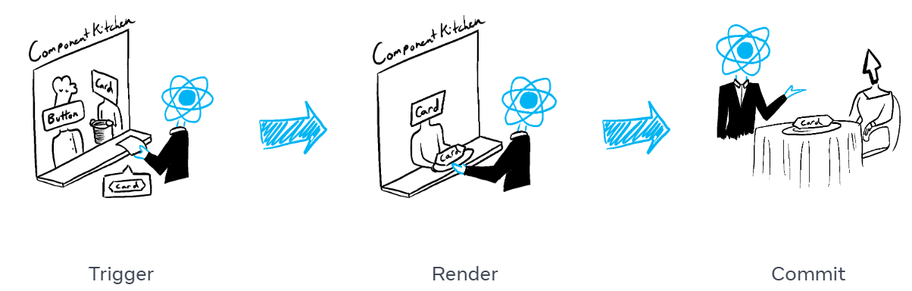

사용자의 입력 혹은 동작에 따라 값이 update될 때가 있다.  
시간이 지남에 따라 변하는 데이터를 **state**라고 한다.  
이번 챕터에서는 상호작용을 처리하고, state를 업데이트하고, 시간에 따라 다른 출력을 표시하는 컴포넌트를 작성하는 방법에 대해 설명한다.  

# 1. Responding to events
```<button>```과 같은 기본 제공 컴포넌트는 ```onClick```과 같은 기본 제공 브라우저 이벤트만 지원한다.  
JSX에서는 이벤트 핸들러 함수를 정의하여 ```onClick```과 같은 이벤트에 적용함으로써 더 다양한 상호작용을 할 수 있다.  

## Event Handler 작성하기
이벤트 핸들러를 함수로 작성하여 적절한 태그에 props로 내려준다.  
button을 클릭하면 alert를 띄워주는 효과를 넣어보자.  
1. Button 컴포넌트 안에 handleClick이라는 함수를 선언  
2. 해당 함수 내부의 로직((alert을 사용하여 메시지 표시))을 구현  
3. JSX의 <button>에 onClick={handleClick}를 추가합니다.  
```javascript
export default function Button() {
  function handleClick() {
    alert('You clicked me!');
  }

  return (
    <button onClick={handleClick}>
      Click me
    </button>
  );
}
```
- 이벤트 핸들러 규칙  
  + 일반적으로 컴포넌트 안에 정의  
  + 이름은 ```handle```로 시작하고 뒤에 이벤트 이름이 오도록 함 ex. handleClick  
  + 인라인으로 작성할 수 있다. (함수가 짧 때) 또한, 인라인으로 작성할 때는 익명 함수로 작성  
  + props로 내려줄 때는 *호출하는 것이 아니라 **전달***  
  + 이벤트 핸들러는 컴포넌트 내부에서 선언되기 때문에 컴포넌트의 props에 접근할 수 있다.  
  + 자식의 이벤트 핸들러를 props로 받을 때 이름을 ```on```으로 시작하고 뒤에 대문자가 오도록 한다.
    ```javascript
    // 이벤트 핸들러를 props로 받을 때 'on'으로 시작
    function Button({ onSmash, children }) {
      return (
        <button onClick={onSmash}>
          {children}
        </button>
      );
    }
    
    export default function App() {
      return (
        <div>
          // 인라인으로 익명함수 작성, 호출이 아닌 전달
          <Button onSmash={() => alert('Playing!')}>
            Play Movie
          </Button>
          <Button onSmash={() => alert('Uploading!')}>
            Upload Image
          </Button>
        </div>
      );
    }
    ```
<br>
  
## Event Propagation
이벤트 핸들러는 자신의 컴포넌트에서만 작동하는 것이 아니라 트리 위로 올라가며 모두 작동한다. => **bubble** 또는 **propagate** 이라고 한다.  
```
<div onClick={() => {
    alert('You clicked on the toolbar!');
  }}>
    <button onClick={() => alert('Playing!')}>
      Play Movie
    </button>
  </div>
);
```
위와 같은 코드에서 Movie 버튼을 누르면 'Playing!' 이라는 알림창이 뜬 후 'You clicked on the toolbar!'라고 뜨면서 2가지 모두 작동한다.  
이는 중지하는 방법이 꼭 필요하다.  

### 전파 중지하기
이벤트 핸들러는 이벤트 객체를 유일한 인수로 받기 때문에 event를 줄여서 "e"로 많이 사용한다.  
이 객체를 사용하여 이벤트에 대한 정보를 읽을 수 있고 전파를 막을 수도 있다. => ```e.stopPropagation()```
```javascript
function Button({ onClick, children }) {
  return (
    <button onClick={e => {
      e.stopPropagation();  // 전파 중지!!!! 
      onClick();
    }}>
      {children}
    </button>
  );
}

export default function Toolbar() {
  return (
    <div onClick={() => {
      alert('You clicked div!');
    }}>
      <Button onClick={() => alert('Playing!')}>
        Play Movie
      </Button>
    </div>
  );
}
```

### default 동작 중지하기
일부 기본 브라우저 이벤트에는 연결된 default 동작들이 있다.  
예. ```<form>```에 onSubmit 이벤트는 버튼을 클릭하면 전체 페이지 로드  
이때, ```e.preventDefault()```를 호출하면 default 동작을 막을 수 있다.  
```javascript
export default function Signup() {
  return (
    <form onSubmit={e => {
      e.preventDefault();
      alert('Submitting!');
    }}>
      <input />
      <button>Send</button>
    </form>
  );
}
```
<br>
  
## Responding to events Recap (이벤트에 응답하기 요약)
- ```<button>```과 같은 태그의 요소에 함수를 prop으로 전달하여 이벤트를 처리할 수 있다.  
- 이벤트 핸들러는 호출이 아니라 전달해야 한다. *onClick={handleClick()} : X,  onClick={handleClick} : O*  
- 이벤트 핸들러 함수를 개별적으로 또는 인라인으로 정의할 수 있다.  
- 이벤트 핸들러는 컴포넌트 내부에 정의되므로 props에 액세스할 수 있다.  
- 부모에서 이벤트 핸들러를 선언하고 이를 자식에게 prop으로 전달할 수 있다.  
- 이름을 지정하여 이벤트 핸들러 prop을 직접 정의할 수 있다.  
- 이벤트는 위쪽으로 전파된다. => 방지하려면 첫 번째 인수에 ```e.stopPropagation()```을 호출하자.
- 이벤트에 원치 않는 기본 브라우저 동작이 있을 수 있다. => 방지하려면 ```e.preventDefault()```를 호출하자.
- 자식 핸들러에서 이벤트 핸들러 prop을 명시적으로 호출하는 것은 전파에 대한 좋은
<br>
  
## Responding to events Try out some challenges (이벤트에 응답하기 도전과제)
### Q1. Fix an event handler
문제 :  
Clicking this button is supposed to switch the page background between white and black.  
However, nothing happens when you click it. Fix the problem.  
(Don’t worry about the logic inside handleClick—that part is fine.)  
  
해결 :  
button의 onClick에 들어가는 이벤트 핸들러 함수인 handleClick이 전달되는 것이 아니라 호출되었기 때문에 작동 X  
```javascript
export default function LightSwitch() {
  function handleClick() {
    let bodyStyle = document.body.style;
    if (bodyStyle.backgroundColor === 'black') {
      bodyStyle.backgroundColor = 'white';
    } else {
      bodyStyle.backgroundColor = 'black';
    }
  }

  return (
    // 호출을 전달로 변경
    <button onClick={handleClick}>
      Toggle the lights
    </button>
  );
}
```

### Q2. Wire up the events
문제 :  
This ColorSwitch component renders a button. It’s supposed to change the page color.  
Wire it up to the onChangeColor event handler prop it receives from the parent so that clicking the button changes the color.  
After you do this, notice that clicking the button also increments the page click counter.  
Your colleague who wrote the parent component insists that onChangeColor does not increment any counters.  
What else might be happening?  
Fix it so that clicking the button only changes the color, and does not increment the counter.  
  
해결  :  
1) 컬러가 바뀌지 않는다 -> onChangeColor를 onClick에 적용  
2) 이벤트가 전파되어 카운트까지 올라간다. -> stopPropation() 적용  
```javascript
export default function ColorSwitch({
  onChangeColor
}) {
  return (
    <button onClick={(e) => {
      e.stopPropagation();
      onChangeColor();
    }}>
      Change color
    </button>
  );
}
```
<br>


# 2. State: A Component's Memory
## state 왜 필요해?
컴포넌트는 상호 작용의 결과로 화면의 내용을 변경해야 하는 경우가 많다.  
form에 입력하면 입력 필드가 업데이트되어야 하고, 구매를 클릭하면 상품이 장바구니에 담겨야 하는 등, 현재의 값을 기억해야 하는데 이때 사용하는 것이 **state**  

'일반 변수로 사용하면 되지 않나?' 생각할 수도 있지만 2가지 이유로 작동이 원활하지 않다.  
1. **Local variables don’t persist between renders.**  
   지역 변수는 렌더링 사이에 유지되지 않는다. 컴포넌트를 재렌더링할 때 처음부터 다시 렌더링 되기 때문에 값이 초기화된다.  
2. **Changes to local variables won’t trigger renders.**  
   지역 변수의 변화는 렌더링을 일으키지 않는다. 지역 변수가 업데이트 되었더라도 렌더링해야 하는 지 react는 알 수 없다.

컴포넌트를 업데이트를 하기 위한 2가지 조건이 모두 충족되지 않기 때문에 이를 유지하기 위한 state가 필요하다.  
```useState``` 훅은 이 모든 것을 제공한다.  
1. 렌더링 사이에 데이터를 유지하기 위한 **state 변수**  
2. 변수를 업데이트하고 렌더링을 일으키는 **state setter 함수**
<br>
  
> ### Hook 이란?
> React에서 "use"라는 단어로 시작하는 함수들은 Hook이라고 한다.
> 렌더링 중일 때만 사용할 수 있는 함수로 컴포넌트가 React 기능을 사용할 수 있게 해주는 특수한 함수이다.
> “컴포넌트의 최상위 레벨” (최상위 컴포넌트 아님) 또는 커스텀 훅(커스텀 훅도 "use"로 시작할 것)에서만 호출할 수 있다.
> 조건문, 반복문 또는 기타 중첩된 함수 내부에서는 훅을 호출할 수 없다.  
> 자세한 내용은 다음 챕터에서 확인
<br>

## useState 사용법
```javascript
import { useState } from 'react';

const [index, setIndex] = useState(0);
const [showMore, setShowMore] = useState(false);
```
```useState```의 사용법은 간단하다.  
state변수에 넣어줄 초기값을 넣어주고 ```[state 변수, setter 함수]``` 로 받아주면 끝!  
useState는 변수와 setter함수를 한 쌍으로 반환하기 때문에 구조분해할당을 통해서 받는다.  
이 쌍의 이름의 ```const [something, setSomething]```으로 짓는 것이 일반적이다.  
state는 서로 연관이 없는 경우 여러 개의 state 변수를 갖는 것이 좋지만, 두 개 이상의 state가 연관이 있다면 *객체를 사용*하여 하나의 state로 만들어 주는 것이 좋다.  
<br>
  
## useState 구동 원리
```javascript
let componentHooks = [];
let currentHookIndex = 0;

// How useState works inside React (simplified).
function useState(initialState) {
  let pair = componentHooks[currentHookIndex];
  if (pair) {
    // This is not the first render,
    // so the state pair already exists.
    // Return it and prepare for next Hook call.
    currentHookIndex++;
    return pair;
  }

  // This is the first time we're rendering,
  // so create a state pair and store it.
  pair = [initialState, setState];

  function setState(nextState) {
    // When the user requests a state change,
    // put the new value into the pair.
    pair[0] = nextState;
    updateDOM();
  }

  // Store the pair for future renders
  // and prepare for the next Hook call.
  componentHooks[currentHookIndex] = pair;
  currentHookIndex++;
  return pair;
}
```
위의 코드가 공식문서에서 내부적으로 useState가 어떻게 구동되는지에 대한 아이디어로 공개한 코드이다.  
useState를 선언할 때마다 ```componentHooks``` 배열에 추가가 되고 setter 함수를 사용하면 DOM을 업데이트 시킴으로써 재렌더링을 시킨다.  
<br>

## state가 Local 하다고?
state는 화면상의 특정 컴포넌트 Instance에 지역적(Local)하다.  
즉, **동일한 컴포넌트를 두 군데에서 렌더링하면 각각은 완전히 격리된 state를 갖게 된다!**  
둘 중 하나의 state를 변경해도 다른 state는 변경되지 않는다. 이것이 일반 변수와 state의 차이점  => **Isolated**  
  
state가 있는 자식 컴포넌트를 사용하는 부모 컴포넌트는 state의 여부조차 알 수 없다.  
props와 달리 **state는 이를 선언하는 컴포넌트 외에는 완전히 비공개**이며, 부모 컴포넌트는 이를 변경할 수 없다. => **Private**  
이러한 이유로 다른 컴포넌트에 영향을 주지 않고 state를 추가하거나 제거할 수 있다.  
<br>
  
## State: A Component's Memory Recap(State : 컴포넌트의 메모리 요약)
- 컴포넌트가 렌더링 사이에 일부 정보를 “기억”해야 할 때 state 변수를 사용한다.  
- state 변수는 useState 훅을 호출하여 선언  
- 훅은 use로 시작하는 특수 함수이다. state와 같은 React 기능을 “연결”할 수 있게 해줍니다.  
- 훅은 모듈에서 import할 때와 마찬가지로, 컴포넌트 안에서 조건과 무관하게 항상 호출해야 한다.  
  useState를 포함한 훅을 호출하는 것은 컴포넌트나 다른 훅의 최상위 레벨에서만 유효하다.  
- useState 훅은 현재 state와 이를 업데이트할 함수로 이루어진 한 쌍을 반환한다.  
- state 변수는 둘 이상 가질 수 있고, 내부적으로 React는 이를 순서대로 일치시킵니다.  
- state는 컴포넌트 외부에 비공개된다. 두 곳에서 렌더링하면 각 복사본은 고유한 state를 갖는다.  
<br>
  
## State: A Component's Memory Try out some challenges (State : 컴포넌트의 메모리 도전 과제)
### Q1. Complete the gallery
문제 :  
When you press “Next” on the last sculpture, the code crashes. Fix the logic to prevent the crash.  
You may do this by adding extra logic to event handler or by disabling the button when the action is not possible.  
After fixing the crash, add a “Previous” button that shows the previous sculpture. It shouldn’t crash on the first sculpture.  
  
해결 :  
1. Next 버튼은 alert를 띄우고 setIndex를 하지 않았다.  
2. Prev 버튼은 활성화/비활성화 기능을 적용했다.  
```javascript
import { useState } from "react";
import { sculptureList } from "./data.js";

export default function Gallery() {
  const [index, setIndex] = useState(0);
  const [showMore, setShowMore] = useState(false);

  function handlePrevClick() {
      setIndex(index - 1);
  }
  function handleNextClick() {
    if (index === sculptureList.length - 1) {
      alert("추후 업데이트 예정");
    } else {
      setIndex(index + 1);
    }
  }

  function handleMoreClick() {
    setShowMore(!showMore);
  }

  let sculpture = sculptureList[index];
  return (
    <>
      <div style={{display: "flex"}}>
        <button disabled={index===0?true:false} onClick={handlePrevClick}>Prev</button>
        <button onClick={handleNextClick}>Next</button>
      </div>
      <h2>
        <i>{sculpture.name} </i>
        by {sculpture.artist}
      </h2>
      <h3>
        ({index + 1} of {sculptureList.length})
      </h3>
      <button onClick={handleMoreClick}>
        {showMore ? "Hide" : "Show"} details
      </button>
      {showMore && <p>{sculpture.description}</p>}
      
    </>
  );
}
```
  
### Q2. Fix stuck form inputs
문제 :  
When you type into the input fields, nothing appears. It’s like the input values are “stuck” with empty strings.  
The value of the first ```<input>``` is set to always match the firstName variable,  
and the value for the second ```<input>``` is set to always match the lastName variable. This is correct. `
Both inputs have onChange event handlers, which try to update the variables based on the latest user input (e.target.value).` 
However, the variables don’t seem to “remember” their values between re-renders.  
Fix this by using state variables instead.  
  
해결 :   
firstName과 lastName을 하나로 묶은 객체를 state로 만들었다.  
change 함수를 하나로 만드려고 했으나 귀찮아서...ㅎ..ㅎㅎ  
```javascript
import { useState } from "react";

export default function Form() {
  const [name, setName] = useState({
    firstName : '',
    lastName : ''
  })
  const {firstName, lastName} = name;

  function handleFirstNameChange(e) {
    const firstName = e.target.value;
    setName({
      ...name,
      firstName : firstName
    })
  }

  function handleLastNameChange(e) {
    const lastName = e.target.value;
    setName({
      ...name,
      lastName : lastName
    })
  }

  function handleReset() {
    setName({
      firstName : '',
      lastName : ''
    })
  }

  return (
    <form onSubmit={e => e.preventDefault()}>
      <input
        placeholder="First name"
        value={firstName}
        onChange={handleFirstNameChange}
      />
      <input
        placeholder="Last name"
        value={lastName}
        onChange={handleLastNameChange}
      />
      <h1>Hi, {firstName} {lastName}</h1>
      <button onClick={handleReset}>Reset</button>
    </form>
  );
}
```

### Q3. Fix a crash
문제 :  
Here is a small form that is supposed to let the user leave some feedback.  
When the feedback is submitted, it’s supposed to display a thank-you message.  
However, it crashes with an error message saying “Rendered fewer hooks than expected”.  
Can you spot the mistake and fix it?  
  
해결 :  
message state가 컴포넌트의 최상위 레벨에서 정의되지 않았기 때문에 에러가 난 것!  
위치를 위로 올려준다.  
```javascript
import { useState } from 'react';

export default function FeedbackForm() {
  const [isSent, setIsSent] = useState(false);
  const [message, setMessage] = useState('');

  if (isSent) {
    return <h1>Thank you!</h1>;
  } 
  
  return (
    <form onSubmit={e => {
      e.preventDefault();
      alert(`Sending: "${message}"`);
      setIsSent(true);
    }}>
      <textarea
        placeholder="Message"
        value={message}
        onChange={e => setMessage(e.target.value)}
      />
      <br />
      <button type="submit">Send</button>
    </form>
  );
}

```

### Q4. Remove unnecessary state
문제 :  
When the button is clicked, this example should ask for the user’s name and then display an alert greeting them.  
You tried to use state to keep the name, but for some reason it always shows “Hello, !“.  
To fix this code, remove the unnecessary state variable. (We will discuss about why this didn’t work later.)  
Can you explain why this state variable was unnecessary?  
  
해결 :  
state는 컴포넌트의 리렌더링 정보에만 사용하는 것이다.  
prompt에서 alert로 넘어가는 로직은 DOM 업데이트가 적용되지 않기 때문에 state를 제거하고 일반 변수를 사용한다.  
```javascript
export default function FeedbackForm() {
  function handleClick() {
    const name = prompt('What is your name?');
    alert(`Hello, ${name}!`);
  }

  return (
    <button onClick={handleClick}>
      Greet
    </button>
  );
}
```
<br>


# 3. Render and Commit
React에서 Rendering 과정에 대해 알아보자.  
> 렌더링의 의미가 뭘까요?? ㅇㅁㅇ????
  
## Redering의 과정

  
컴포넌트가 렌더링되는 과정을 항상 요리사와 웨이터로 비유되곤 한다.  
주방에서 요리사가 컴포넌트를 요리하면 사용자에게 주문을 받고 서빙을 하는 과정을 웨이터 역할을 React가 담당하고 있다.  
위의 그림을 설명하자면, 
1. 손님의 주문을 주방으로 전달 => 렌더링 활성화  
2. 주방에서 주문 받기 => 컴포넌트 렌더링  
3. 테이블에 주문한 요리 내놓기 => DOM에 커밋
<br>

### STEP 1. Trigger a render
렌더링이 일어나는 상황 2가지
1. 컴포넌트의 **첫 렌더링**일 때
2. 컴포넌트의 **state가 업데이트** 된 경우 (혹은 상위 요소 중 하나)
   컴포넌트의 state를 업데이트하면 자동으로 렌더링이 대기열에 추가

### STEP 2. React renders your components
**"Redering”은 React에서 컴포넌트를 호출하는 것**  
첫 렌더링에서 React는 루트 컴포넌트를 호출한다. 이후 렌더링에서 React는 state 업데이트에 의해 렌더링이 발동된 함수 컴포넌트만을 호출한다.  
이 과정은 재귀적이기 때문에 중첩된 컴포넌트가 더 이상 없고 React가 화면에 표시되어야 하는 내용을 정확히 알 때까지 이 단계는 계속된다.  

> ### Redering은 항상 Pure Caculation이어야 한다.
> - 동일한 입력에는 동일한 출력
> - 이전의 state를 변경 X
>   렌더링 전에 존재했던 객체나 변수를 변경해서는 안 된다.

### STEP 3. React commits changes to the DOM
렌더링 간에 차이가 있는 경우에만 DOM 노드를 변경 

## Render and Commit Reacap (렌더링하고 커밋하기 요약)
- React 앱의 모든 화면 업데이트 세 단계
  1. 트리거
  2. 렌더링
  3. 커밋
- Strict Mode를 사용하여 컴포넌트에서 실수를 찾을 수 있다.
- 렌더링 결과가 이전과 같으면 React는 DOM을 건드리지 않는다.
<br>
  
  
# 4. State as a Snapshot
state는 읽고 쓸 수 있는 일반 JS 변수처럼 보이지만, snapshot 처럼 작동한다.  

## state setting 과 re-render trigger
클릭과 같은 사용자 이벤트에 대해서 UI가 직접 변경되는 것 처럼 보이지만 사실이 아니다.  
React에서는 UI에 반응하여 적용하기 위해서는 state을 업데이트하여 re-rendering을 일으켜야 한다.  
1. 이벤트 핸들러가 실행  
2. 핸들러 안에 있는 함수를 실행시키는 렌더링이 Queue에 대기  
3. 새로운 state에 따라서 컴포넌트를 재렌더링
  
렌더링이란 컴포넌트 즉, 함수를 호출한다는 뜻이다. <span style="background-color:#E6E6FA">이때 반환된 JSX는 호출된 시점의 스냅샷을 가지고 있다.</span>  


## state 설정으로 리렌더링이 촉발되는 방식
state 업데이트 시기 및 방법
state를 설정한 직후에 state가 업데이트되지 않는 이유
이벤트 핸들러가 state의 ‘스냅샷’에 액세스하는 방법
